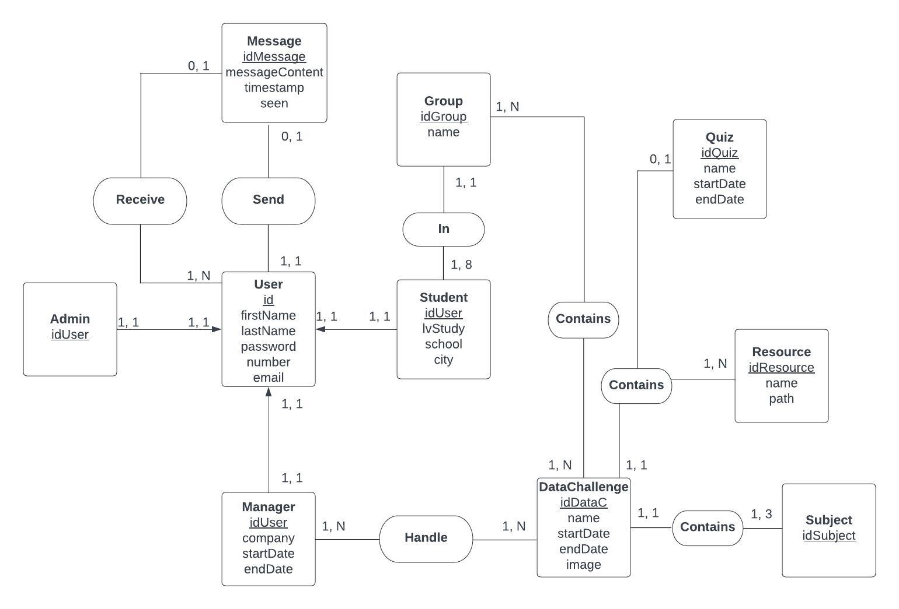

# Introduction

Dans le cadre de notre première année du cycle ingénieur, il nous est proposé la réalisation d'un projet pour mettre en pratique nos connaissances.
Ce projet consiste en la réalisation d'une application pour IA Pau permettant la création et l'administration de data challenges.

# Stockage des données

L'utilisation d'une base de données dans le contexte de ce projet est évident pour pouvoir stocker diverses informations comme celles concernant les utilisateurs ou les data chalenges.
Ainsi, nous avons réalisé un modèle conceptuel de données (MCD) pour réaliser ensuite la structure de la base de données.

## Le Modèle conceptuel de données

Vous pouvez trouver le MCD ci-dessous.
Un utilisateur peut être soit un administrateur, un gestionnaire ou un étudiant (un participant).
Un ensemble d'utilisateurs quelconques peut recevoir un message donné et un utilisateur peut aussi envoyer un message. On peut considérer qu'un étudiant puisse envoyer un message à un administrateur sous des conditions particulières (requête pour résoudre un bug, etc) qui peuvent être gérées lors du développement de l'application.
Un même groupe peut participer à plusieurs data challenge en même temps d'où la cardinalité dans le MCD.

Par contre tous les data challenges ont des sujets différents, des resources différentes et s'ils contiennent un quiz, un quiz différent les uns des autres. D'où la cardinalité (1, 1) du côté de la table DataChallenge.
Enfin, on considère qu'un gestionnaire gère le data challenge complet (on aurait pu définir des gestionnaires qui gèrent seulement un ou des sujets d'un data challenge).

{height=40%}

## La base de données

Nous avons choisi d'utiliser la base de données mySQL pour stocker les informations nécessaires.

Nous avons pris parti d'inclure l'identifiant des data challenge en tant que clé étrangère dans les tables Quiz et Resource puisqu'elles sont uniques à chaque data challenge ainsi qu'à la table Group puique le cas d'un même groupe qui participe à plusieurs data challenges en même temps reste un cas très particulier.

## Gestion de la connexion à la base de données
Plusieurs fonctions php pour gérer la connexion à la base de données sont présentes dans le fichier bdd.php. 

On a : 

## Récupération des données de la base de données
Another paragraphe

## Modification des données de la base de données
Another paragraphe

# Les fonctionnalités implémentées
The second paragraph

# Les fonctionnalités qui restent à implémenter
Another paragraph
    